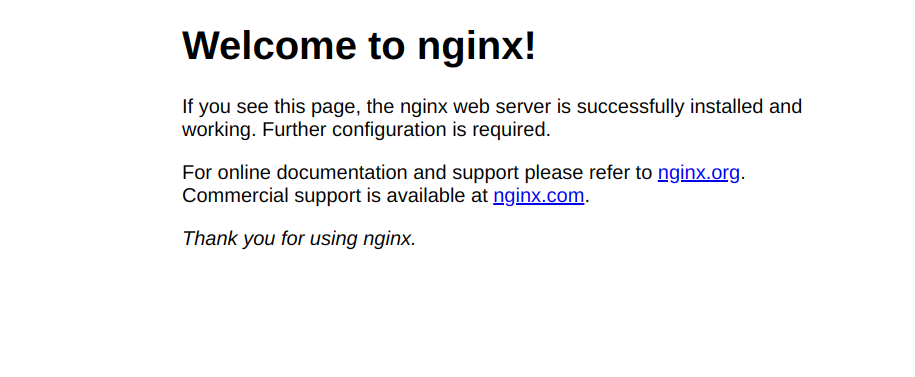

# Hướng dẫn deploy project VueJS Quasar mới với CI/CD trên AWS EC2 với Nginx

## Tổng quan

Bài hướng dẫn này sẽ giúp bạn:

- Tạo một project **VueJS Quasar** mới.
- Deploy ứng dụng dưới dạng static site lên **Amazon S3** và phân phối qua **CloudFront**.
- Tích hợp **CI/CD** bằng **GitHub Actions** để tự động build và deploy khi push code.
- Tối ưu chi phí bằng cách tận dụng **AWS Free Tier**.

### Yêu cầu

- Tài khoản AWS (Free Tier nếu mới bắt đầu).
- Tài khoản GitHub.
- Node.js (v18 hoặc cao hơn) và npm/yarn cài trên máy local.
- Cơ bản về terminal và Git.

---

## Bước 1: Tạo project Quasar mới

1. **Cài Quasar CLI**:

   ```bash
   npm install -g @quasar/cli
   ```

2. **Tạo project Quasar**:

   ```bash
   quasar create my-quasar-app
   ```

   - Chọn các tùy chọn:
     - **Project name**: `my-quasar-app`.
     - **Framework**: Vue 3.
     - **Features**: ESLint, Vuex (tùy chọn), Vue-i18n (nếu cần).
     - **Package manager**: npm (hoặc yarn nếu bạn thích).
   - Sau khi tạo, vào thư mục project:
     ```bash
     cd my-quasar-app
     ```

3. **Chạy thử local**:

   ```bash
   quasar dev
   ```

   - Mở trình duyệt tại `http://localhost:9000` để kiểm tra giao diện mặc định của Quasar.

4. **Tạo Git repository**:
   ```bash
   git init
   git add .
   git commit -m "Initial Quasar project"
   ```
   - Tạo repository trên GitHub (ví dụ: `my-quasar-app`).
   - Push code lên:
     ```bash
     git remote add origin https://github.com/<your-username>/my-quasar-app.git
     git branch -M main
     git push -u origin main
     ```

---

## Bước 2: Cấu hình AWS cho deployment

1. **Tạo EC2 instance**:

   - Đăng nhập vào AWS Console.
   - Tạo mới EC2 instance với các tùy chọn:
     - **Instance type**: Tùy chọn miễn phí (ví dụ: t2.micro).
     - **OS**: Ubuntu 20.04.
     - **Security group**: Tạo mới và cho phép HTTP và HTTPS.
     - **Key pair**: Tạo mới và tải xuống private key.

2. **Đăng nhập vào EC2**:

   - Sử dụng private key để SSH vào instance.
     ```bash
     ssh -i <private-key>.pem ubuntu@<ec2-public-ip>
     ```
   - Cấu hình SSH để sử dụng private key:

     ```bash
     sudo nano /etc/ssh/sshd_config
     ```

     - Đảm bảo có dòng không bị comment:
       ```bash
       PubkeyAuthentication yes
       AuthorizedKeysFile .ssh/authorized_keys
       ```
     - Khởi động lại SSH:

       ```bash
       sudo systemctl restart sshd
       ```

   - Kiểm tra trạng thái SSH:

     ```bash
     sudo systemctl status sshd
     ```

     Đảm bảo SSH đang chạy active (running) :

     Ví dụ:

     ```bash
     ● ssh.service - OpenBSD Secure Shell server
     Loaded: loaded (/lib/systemd/system/ssh.service; enabled; vendor preset: enabled)
     Drop-In: /usr/lib/systemd/system/ssh.service.d
     └─ec2-instance-connect.conf
     Active: active (running) since Mon 2025-04-14 03:54:13 UTC; 14s ago
     Docs: man:sshd(8)
     man:sshd_config(5)
     Process: 1412 ExecStartPre=/usr/sbin/sshd -t (code=exited, status=0/SUCCESS)
     Main PID: 1413 (sshd)
     Tasks: 1 (limit: 1129)
     Memory: 1.7M
     CPU: 19ms
     CGroup: /system.slice/ssh.service
     └─1413 "sshd: /usr/sbin/sshd -D -o AuthorizedKeysCommand /usr/share/ec2-instance-connect/eic_run_authorized_keys %u %f -o AuthorizedKeysComm>
     ```

3. **Cài đặt Nginx và cấu hình**:

   - Cài đặt Nginx:
     ```bash
     sudo apt update
     sudo apt install nginx -y
     ```
   - Khởi động Nginx:

     ```bash
     sudo systemctl start nginx
     ```

   - Bật Nginx để khởi chạy cùng hệ thống:

     ```bash
     sudo systemctl enable nginx
     ```

   - Kiểm tra trạng thái Nginx:

     ```bash
     sudo systemctl status nginx
     ```

     Ví dụ:

     ```bash
     ● nginx.service - A high performance web server and a reverse proxy server
     Loaded: loaded (/lib/systemd/system/nginx.service; enabled; vendor preset: enabled)
     Active: active (running) since Mon 2025-04-14 04:00:49 UTC; 27s ago
       Docs: man:nginx(8)
     Main PID: 8539 (nginx)
      Tasks: 2 (limit: 1129)
     Memory: 3.2M
        CPU: 19ms
     CGroup: /system.slice/nginx.service
             ├─8539 "nginx: master process /usr/sbin/nginx -g daemon on; master_process on;"
             └─8542 "nginx: worker process" "" "" "" "" "" "" "" "" "" "" "" "" "" "" "" "" "" "" "" "" "" "" "" "" "" "" ""
     ```

4. **Mở port 80 (nếu chưa mở)**:

Vào AWS EC2 Console → Security Groups → Chọn security group đang dùng

Add rule:
| Type | Protocol | Port | Source |
| --- | --- | --- | --- |
| Custom TCP | TCP | 80 | 0.0.0.0/0 |
| Custom TCP | TCP | 443 | 0.0.0.0/0 |

Truy cập IP EC2 qua trình duyệt:

```bash
http://<ec2-public-ip>
```



---

## Bước 3: Tích hợp CI/CD với GitHub Actions

1. **Tạo repository GitHub**:

   - Tạo repository mới trên GitHub.
   - Push code lên repository.

2. **Tạo GitHub Actions**:
